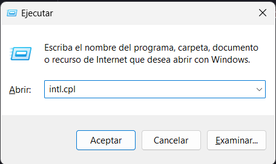
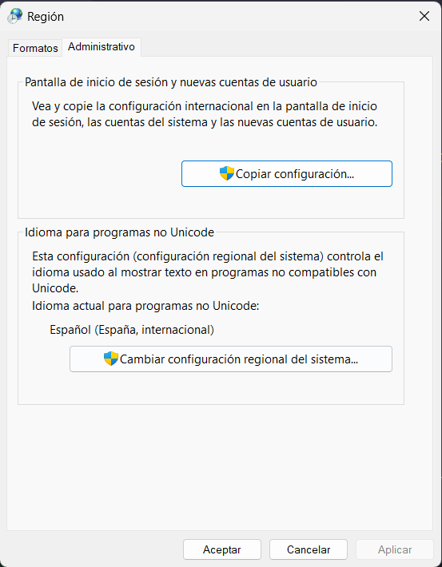
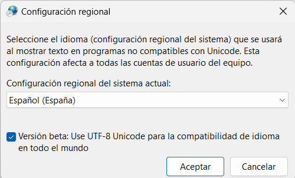
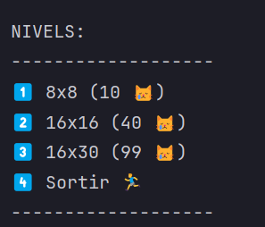
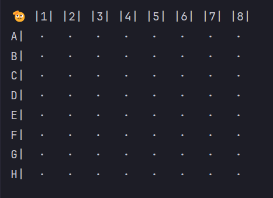
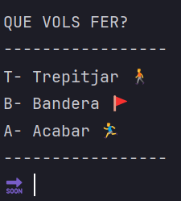
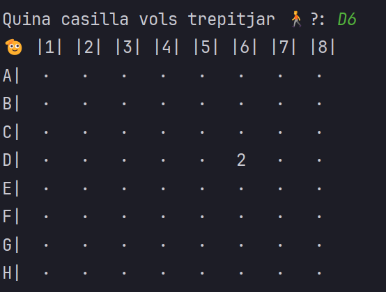
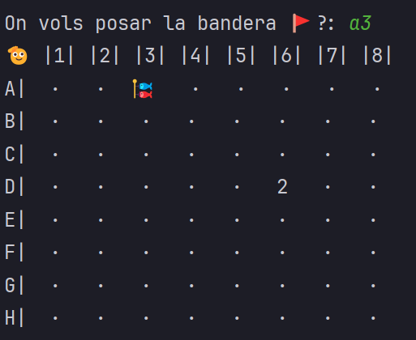

Este proyecto es, en escencia, una recreación en java y por consola del famoso juego. 
Sin embargo, esta tematizado de gatos.

<!-- TOC -->
  * [Consideraciones previas](#consideraciones-previas-)
    * [⚙️ Activar emojis en windows](#-activar-emojis-en-windows-)
  * [Como ejecutar el juego](#como-ejecutar-el-juego)
  * [Reglas](#reglas)
  * [Overview 🧐](#overview-)
<!-- TOC -->


## Consideraciones previas 

---
`⚠️ Hay que tener instalado java para poder jugar`

### ⚙️ Activar emojis en windows 

 Para ver los emojis[^1] en la terminal de windows sigue estos pasos:

1. presiona `Windows + r` y pega este comando
```
intl.cpl
```


2. En el panel de configuracion 
clica [Administrativo], luego [Cambiar configuracion local del sistema]



3. Activar la casilla de verificación



[^1] Es una funcion experimental por lo que no todos los emojis estan soportados. 
(Fuente: https://github.com/spectreconsole/spectre.console/issues/113)

## Como ejecutar el juego

---
1. Descargar [MinesDGR.jar](out%2Fartifacts%2FMinesDGR_jar%2FMinesDGR.jar)
2. navegar hasta la carpeta en la que esta el jar y abrir un terminal ahi
3. Ejecutar
   ```java
    java -jar MinesDGR.jar
    ```
4. Divertirse 🎮

## Reglas

--- 

+ El juego consiste en despejar todas las casillas de una pantalla que no oculten una mina.


+ Algunas casillas tienen un número, este número indica los gatos que hay en todas las casillas circundantes. Así, si una casilla tiene el número 3, significa que de las 8 casillas que hay alrededor (si no es en una esquina o borde) hay 3 con gatos y 5 sin gatos. 


+ Si se descubre una casilla sin número indica que ninguna de las casillas vecinas tiene un gato y estas se descubren automáticamente.


+ Si se descubre una casilla con una gato se pierde la partida.


+ Se puede poner una marca en las casillas que el jugador piensa que hay minas para ayudar a descubrir la que están cerca.

## Overview 🧐

--- 


El juego cuenta con `3 niveles` de dificultad seleccionables al inicio, cada uno con su correspondiente numero 
de ```gatos``` a encontrar



Una vez seleccionada la dificultad comienza el juego y se imprime el tablero con el número de casillas.
y gatos ocultos correspondiente

por ejemplo:

8x8 y 10 😸



Acto seguido, se pregunta al jugador qué desea hacer usando un menu de opciones:




`Trepitjar` - Quiere decir que se va a revelar la casilla que se introduzca por teclado, por ejemplo `D6`.



`Bandera` - Quiere decir que se marcara la casilla como sospechosa de tener un gato, por ejemplo marcamos `A3`.



si en algún momento ya no se quiere jugar, simplemente habrá que seleccionar la opción de `Acabar`

